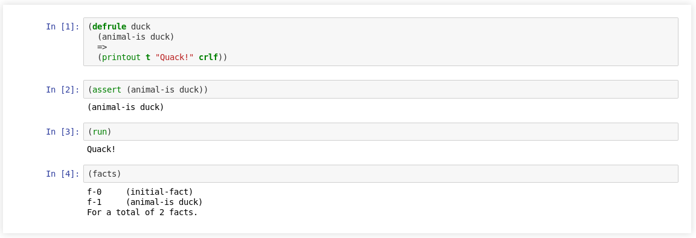

iCLIPS
======

Jupyter Kernel for CLIPS_

:Source: https://github.com/noxdafox/iclips
:Documentation: https://iclips.readthedocs.io

|docs badge|

.. |docs badge| image:: https://readthedocs.org/projects/iclips/badge/?version=latest
   :target: http://iclips.readthedocs.io/en/latest/?badge=latest
   :alt: Documentation Status

Installation
------------

Detailed instructions in the documentation.

.. code:: bash

    pip install iclips

Usage
-----

.. code:: bash

    jupiter console --kernel clips

.. _CLIPS: http://www.clipsrules.net/
